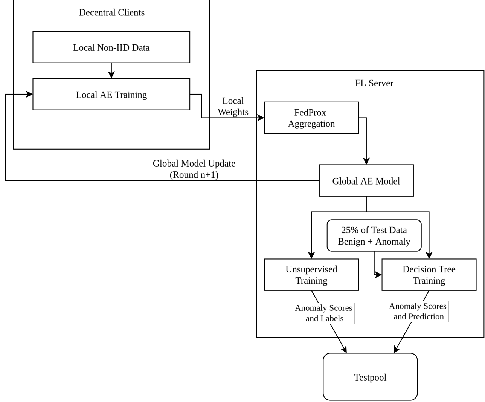

# TinyFL Model: ML Based IDS for IoT Botnet Detection



- [TinyFL Model: ML Based IDS for IoT Botnet Detection](#tinyfl-model-ml-based-ids-for-iot-botnet-detection)
  - [Deploying the Model on PC / Singular Device](#deploying-the-model-on-pc--singular-device)
  - [Deploying the Model on Embedded Devices (Raspberry Pis etc.)](#deploying-the-model-on-embedded-devices-raspberry-pis-etc)
    - [Launching the Flower SuperLink](#launching-the-flower-superlink)
    - [Connecting Flower SuperNodes](#connecting-flower-supernodes)
    - [Run the Flower App](#run-the-flower-app)
  - [Deploying the Model for inference on ESP32](#deploying-the-model-for-inference-on-esp32)
    - [Deploying the Model on ESP32 after a Simulation run](#deploying-the-model-on-esp32-after-a-simulation-run)
      - [pytorch -\> onnx -\>tf -\>tflite with quant-\>.h](#pytorch---onnx--tf--tflite-with-quant-h)

## Deploying the Model on PC / Singular Device

Go to the Folder `Python_FL_Model` and follow the `README`

## Deploying the Model on Embedded Devices (Raspberry Pis etc.)

Follow this Tutorial [Embedded Devices](https://github.com/adap/flower/tree/main/examples/embedded-devices). 
Instead of cloning their example use mine.

### Launching the Flower SuperLink

On your development machine, launch the `SuperLink`. You will connnect Flower `SuperNodes` to it in the next step.
```bash
flower-superlink --insecure
```
### Connecting Flower SuperNodes

With the 'SuperLink' up and running, we can now launch a `SuperNode` on each embedded device. To do this, make sure you know the IP address of the machine running the `SuperLink` and that the necessary data has been copied to the device.
Ensure the Python environment you created earlier when setting up your device has all dependencies installed. 
Now, launch your 'SuperNode'  
```bash
# Repeat for each embedded device (adjust SuperLink IP and partition-id)
flower-supernode  --insecure      --superlink SuperLink IP:9092    --node-config "partition-id=0 num-partitions=4"
```
Repeat for each embedded device that you want to connect to the `SuperLink`. Change partition-id if you want the Client to use different Data.

If you want to use SuperLink and SuperNode on PC with multiple Terminals launch 'Supernode' with this
```bash
# Repeat for each embedded device (adjust SuperLink IP, Clientappio Port and partition-id)
flower-supernode  --insecure      --superlink SuperLink IP:9092  --clientappio-api-address 127.0.0.1:9097  --node-config "partition-id=0 num-partitions=4"
```
Change the clientappio-api-address Port for each Client. Change partition-id if you want the Client to use different Data.

### Run the Flower App

With both the long-running server (`SuperLink`) and two `SuperNodes` up and running, we can now start run. Let's first update the Flower Configuration file to add a new `SuperLink` connection.

Locate your Flower configuration file by running:
```bash
flwr config list
```
```bash
# Example output:
Flower Config file: /path/to/your/.flwr/config.toml
SuperLink connections:
 -supergrid
 -local (default)
```
Open this configuration file and add a new `SuperLink` connection at the end:
```bash
[superlink.embedded-federation]
address = "127.0.0.1:9093" # ControlAPI of your SUPERLINK
insecure = true
```
Finally, run your Flower App in your federation:
```bash
flwr run . embedded-federation
```
## Deploying the Model for inference on ESP32

### Deploying the Model on ESP32 after a Simulation run 

Take the resulting Files `final_model.pt`,`calibration_data.npy`,`tree_model.h`,`mcu_test_data.h`,`mcu_val_data.h` from the folder `Python_FL_Model`.
Copy `tree_model.h`, `mcu_test_data.h` and ,`mcu_val_data.h` into the folder `ESP32_Model/main` from the folder `TINYML`.
Copy `final_model.pt` and `calibration_data.npy` into the folder `Model_converter`.

#### pytorch -> onnx ->tf ->tflite with quant->.h
create new venv, look at tinyml_env2
1. take final_model.pt
2. drag it into TinyML_Conversion 
3. run converter_onnx.py do it both for normal model and encoder. With an enviroment that has both torch and onnx.
4. new terminal with tinyml_env2 as enviroment run:
```bash
onnx2tf -i model.onnx -o saved_model
onnx2tf -i model_encoder.onnx -o saved_model_enc
```
5. run converter_tf_tflite_fix_hard.py
6. run converter_tflite_c.py
7. copy the files `model.h` and `model_encoder.h` into the folder `TINYML/main`

## BibTeX entry
Please cite this project using the following bibtex entry: <br>
[](https://shields.io/)
```bibtex
@inproceedings{}
```
